<div align="center">

# ERG_Lopez_et_al

### Single-cell dissection of stemness programs and transcriptional plasticity in acute myeloid leukemia relapse
**Research Code & Data Companion**

[](https://github.com/js2920/ERG_Lopez_et_al)
[](https://zenodo.org/records/23058363)
[](https://www.python.org/)
[](https://scvi-tools.org/)
[](https://pytorch.org/)
[](LICENSE)

<br/>

[Overview](#overview) • [Key Publication Figures](#key-publication-figures) • [Reproduction Quickstart](#reproduction-quickstart) • [Analytical Framework](#analytical-framework) • [Pipeline Scripts](#pipeline-scripts) • [Audit & Parity](#statistical-validation--parity-audit) • [Methods & Data](#mathematical--formal-methods)

</div>

---

> [!NOTE]
> **Research Companion**: This repository contains the peer-review code package, workflow specifications, and statistical validation suite accompanying **Lopez et al. (2026)**. The implementation integrates multi-cohort deep generative modeling (scVI/scANVI), within-condition data diffusion (MAGIC), and paired non-parametric inference to characterize ERG-mediated stemness rewiring across matched diagnosis–relapse pediatric acute myeloid leukemia (pAML) cohorts.

---

## Overview

Therapeutic resistance and relapse in pediatric AML remain predominantly driven by the survival and expansion of leukemic stem cells (LSCs). This codebase provides the complete computational pipeline developed to test whether transcriptional activation of the ETS-family transcription factor **ERG** marks an immature, treatment-refractory blast state that undergoes clonal expansion at relapse.

### Key Computational Tenets
- **Harmonized Generative Integration**: Overcomes technical batch confounding between disease and developmental controls without erasing temporal relapse dynamics by assigning patient-level batch keys (`aml_id`).
- **Semi-Supervised Latent Transfer (scANVI)**: Benchmarked across triplicate seeds with held-out normal progenitor validation (88.9% concordance) and strict preservation of malignant divergence.
- **Timepoint-Isolated Manifold Imputation (MAGIC)**: Solves single-cell dropout for regulatory transcription factors without across-condition information leakage.
- **Direction-Aware Stemness Quantification (pyUCell)**: Single-cell resolution scoring of the clinically validated 17-gene LSC17 signature.
- **Paired Clonal Inference**: Rigorous Wilcoxon signed-rank paired testing evaluating 176,397 malignant blasts across 20 matched patient pairs.


---

## Reproduction Quickstart

The full figure generation suite and numerical audit can be executed in under one minute using precomputed tables, or recomputed end-to-end from raw count matrices.

```bash
# 1. Clone repository & create conda environment
git clone https://github.com/js2920/ERG_Lopez_et_al.git
cd ERG_Lopez_et_al
conda env create -f environment.yml
conda activate erg-lopez-et-al

# 2. Run automated validation audit and generate publication figures (PNG, PDF, SVG)
./run_all.sh
```

Alternatively, standard target rules are provided via [`Makefile`](Makefile):
```bash
make audit      # Execute automated numerical parity assertions (< 1 second)
make figures    # Render publication-ready Figures 4 and 11
make all        # Execute full audit and figure generation pipeline
```

---

## Analytical Framework

```mermaid
flowchart TD
    subgraph Input ["Multi-Cohort Transcriptomes"]
        D1["Circulating CD34+ HSPCs across Lifespan<br/><i>Furer/Shlush et al. Nat Med 2025</i>"]
        D2["Human Fetal Liver Hematopoietic Progenitors<br/><i>Suo et al. Science 2022</i>"]
        D3["Pediatric AML Matched Diagnosis & Relapse<br/><i>Lambo et al. GSE235063</i>"]
    end

    subgraph Step1 ["1. Harmonization & Ranked Feature Selection"]
        H1["Lineage Harmonization & Progenitor Tier Stratification"]
        H2["Hierarchical Batch Key Allocation<br/><i>Healthy: Library / pAML: aml_id</i>"]
        H3["Consensus Feature Space<br/><i>4,000 HVGs rank-aggregated across 4 biological compartments</i>"]
    end

    subgraph Step2 ["2. Deep Generative Latent Space Modeling"]
        S1["Controlled Replication Weighting<br/><i>3x Healthy Reference, 2x Normal pAML Bridge</i>"]
        S2["Unsupervised scVI Pretraining<br/><i>ZINB likelihood, 30 latent dimensions</i>"]
        S3["Semi-Supervised scANVI Transfer<br/><i>Malignant blasts masked as unobserved</i>"]
        S4["Multi-Seed Evaluation & Holdout Validation<br/><i>Seed 43 selected: 88.9% normal holdout concordance</i>"]
    end

    subgraph Step3 ["3. Manifold Imputation & Signature Scoring"]
        M1["Timepoint-Isolated MAGIC Diffusion<br/><i>t=3, k=15 fitted separately for DX and REL</i>"]
        M2["Direction-Aware pyUCell Scoring<br/><i>11 stemness-positive vs. 6 differentiation-negative genes</i>"]
    end

    subgraph Step4 ["4. Visualization"]
        F4["Figure 4: Progenitor UMAP Latent Space"]
        F11["Figure 11: Patient-Level Diagonal Shift Plot"]
    end

    subgraph Step5 ["5. Statistical Validation & Parity Audit"]
        A1["15/20 Cohorts Expand ERG+ Fraction<br/><i>Wilcoxon p = 0.00271, Mean shift: 11.1% to 19.6%</i>"]
    end

    Input --> Step1
    Step1 --> Step2
    Step2 --> Step3
    Step3 --> Step4
    Step4 --> Step5

    style Step1 fill:#f8f9fa,stroke:#495057,stroke-width:1px
    style Step2 fill:#e8f4f8,stroke:#0077b6,stroke-width:1.5px
    style Step3 fill:#e8f5ee,stroke:#2a9d8f,stroke-width:1.5px
    style Step4 fill:#fff3cd,stroke:#d4a373,stroke-width:1.5px
    style Step5 fill:#e2e3e5,stroke:#343a40,stroke-width:1.5px
```



---

## Pipeline Scripts

The analytical workflow is consolidated into three self-contained, executable scripts in the repository root:

| Script | Purpose | Output | CLI Execution |
| :--- | :--- | :--- | :--- |
| **[`render_figures.py`](render_figures.py)** | Renders **Figure 4** (Progenitor UMAPs: ERG MAGIC & LSC17 UCell) and **Figure 11** (Matched ERG fraction diagonal shift across 20 cohorts) | Publication PNG (400 DPI), vector PDF, and editable SVG | `python render_figures.py --figures all` |
| **[`audit_parity.py`](audit_parity.py)** | Unit-level statistical assertion suite checking exact parity against reported paper statistics ($15/20$ expand, $p = 
| **[`train_scvi_scanvi.py`](train_scvi_scanvi.py)** | End-to-end deep generative integration: multi-compartment ranked HVGs, weighted training, unsupervised scVI, semi-supervised scANVI, and MAGIC diffusion | Converged joint AnnData (`joint_scvi_G.h5ad`) | `python train_scvi_scanvi.py` |

---

## Statistical Validation & Parity Audit

The verification test suite ([`audit_parity.py`](audit_parity.py)) evaluates computed pipeline outputs directly against the locked manuscript benchmarks:

| Statistical Metric | Reported Manuscript Value | Computed Package Value | Verification Status |
| :--- | :---: | :---: | :---: |
| **Paired Patients** | 20 | 20 | Confirmed (Exact) |
| **Total Malignant Cells** | 176,397 | 176,397 | Confirmed (Exact) |
| **Patients with ERG Expansion** | 15 / 20 (75.0%) | 15 / 20 (75.0%) | Confirmed (Exact) |
| **Paired Wilcoxon Signed-Rank $p$** | $0.00271$ | $0.002712$ | Confirmed ($p < 0.01$) |
| **Diagnosis Cohort Mean** | 11.1% | 11.12% | Confirmed |
| **Relapse Cohort Mean** | 19.6% | 19.63% | Confirmed |
| **Normal Progenitor Concordance** | $\ge 85.0\%$ | $88.91\%$ | Confirmed |
| **Malignancy Mixing (Signal Retention)** | $\le 5.0\%$ | $1.83\%$ | Confirmed |

To run the audit suite directly:
```bash
python audit_parity.py
```

---

## Mathematical & Formal Methods

A full mathematical derivation of the scVI evidence lower bound (ELBO), zero-inflated negative binomial (ZINB) likelihood, MAGIC diffusion operators ($P^t$), and UCell rank equations is provided in [`docs/METHODS.md`](docs/METHODS.md).

---

## Data Availability & Citations

### Primary Datasets
- **Trained Latent Space & Coordinates (`joint_scvi_G.h5ad`)**: Lopez et al., *Harmonized Single-Cell scANVI Latent Space and UMAP Coordinates for Pediatric AML Relapse and Hematopoietic Progenitors*. **Zenodo** (2026). DOI: [10.5281/zenodo.23058363](https://doi.org/10.5281/zenodo.23058363) ([Record 23058363](https://zenodo.org/records/23058363)).
- **Pediatric AML Cohort**: Lambo et al., *The genomic and transcriptomic landscape of pediatric AML relapse*. *Cancer Cell* (GEO Accession: [GSE235063](https://www.ncbi.nlm.nih.gov/geo/query/acc.cgi?acc=GSE235063)).
- **Circulating CD34+ HSPCs (Lifespan Atlas)**: Furer, N., Rappoport, N., Milman, O. ... Tanay, A., Shlush, L. I. *A reference model of circulating hematopoietic stem cells across the lifespan with applications to diagnostics*. *Nature Medicine* 31, 2442–2451 (2025). (CZ CELLxGENE Collection: [5542eeb0-96ef-4ab9-95ea-eb6abc178461](https://cellxgene.cziscience.com/collections/5542eeb0-96ef-4ab9-95ea-eb6abc178461); GEO: [GSE285943](https://www.ncbi.nlm.nih.gov/geo/query/acc.cgi?acc=GSE285943)).
- **Human Fetal Liver Progenitors**: Suo et al., *Mapping the developing human immune system across development*. *Science* 376, eabo0510 (2022).

### Methodological References
1. Lopez et al. (In Review, 2026).
2. Gayoso, A. et al. A Python library for probabilistic analysis of single-cell omics data. *Nat. Biotechnol.* 40, 163–166 (2022).
3. van Dijk, D. et al. Recovering Gene Interactions from Single-Cell Data Using Data Diffusion. *Cell* 174, 716–729 (2018).
4. Andreatta, M. & Carmona, S. J. UCell: Robust and scalable single-cell gene signature scoring. *Comp. Struct. Biotechnol. J.* 19, 3796–3798 (2021).
5. Ng, S. W. et al. A 17-gene stemness score for rapid determination of risk in acute leukaemia. *Nature* 540, 433–437 (2016).

---

## License
This project is open-sourced under the terms of the [MIT License](LICENSE).
